# EZBlender: Efficient 3D Editing with Plan-and-ReAct Agent
The official implementation of the paper [EZBlender: Efficient 3D Editing with Plan-and-ReAct Agent](https://openaccess.thecvf.com/content/WACV2026W/VALED/html/Wang_EZBlender_Efficient_3D_Editing_with_Plan-and-ReAct_Agent_WACVW_2026_paper.html)


## Updates
- 4/16/2026: Shipped an agent skill under [`.agents/skills/ezblender/`](.agents/skills/ezblender) (`/ezblender`).
- 4/10/2026: We are currently packaging the entire workflow into a skill for AI agents.
- 4/1/2026: We are currently working on the EZBench that benchmarking the ability of 3D editing among Models/Agents. 
- 3/27/2026: We re-constructed the code using Codex CLI. 
- 1/7/2026: Our paper is selected as the best paper.
- 1/1/2026: Our paper is accepted by WACV2026@VALED.

EZBlender is a lightweight, modular framework for automating 3D scene editing in Blender using Vision-Language Models (VLMs). It employs a multi-agent architecture where a central **Planner** decomposes high-level user prompts into specific sub-tasks for specialized agents (**Modder**, **Material**, **Lighting**, **Camera**, etc.).

<p align="center">
  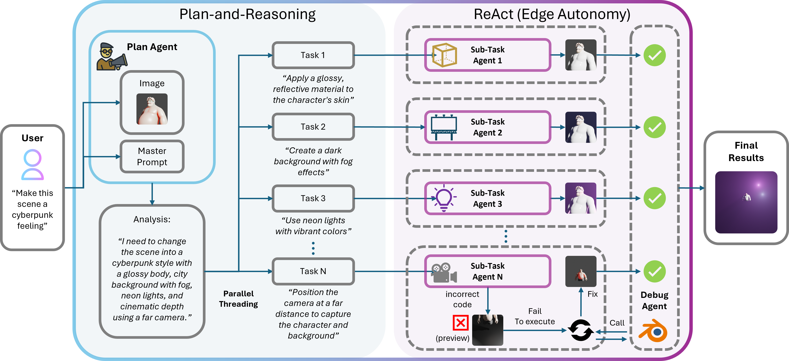
</p>


### MathBlender
- We are integtrating the math interpretability into the current workflow:
<p align="center">
  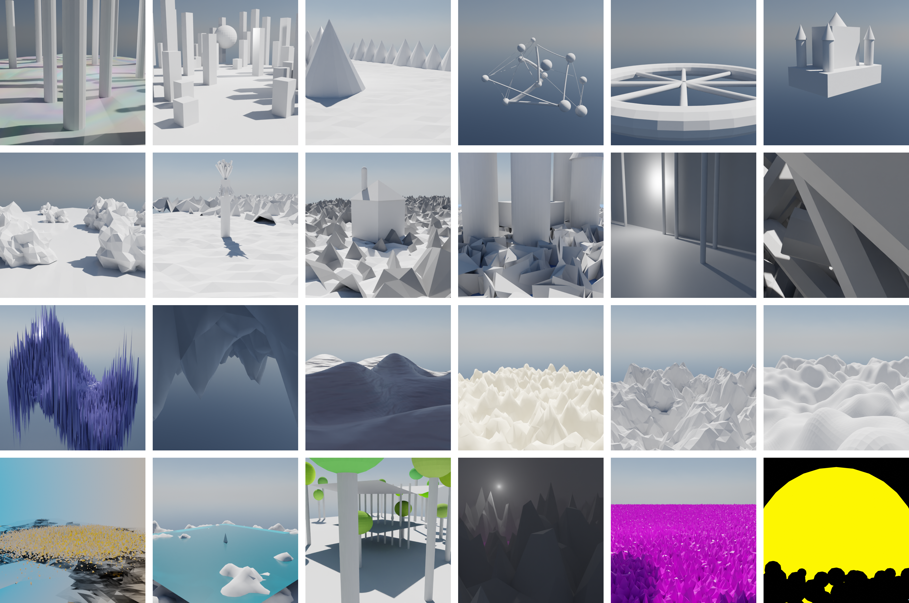
</p>


## Key Features

- **Multi-Agent Pipeline**: Intelligent task decomposition and execution.
- **Vision-Feedback Loop**: Autonomous refinement based on visual output analysis.
- **Modular Design**: Easily extendable with new agent roles or VLM providers.
- **Automatic Debugging**: Integrated error analysis and code fixing.

<p align="center">
  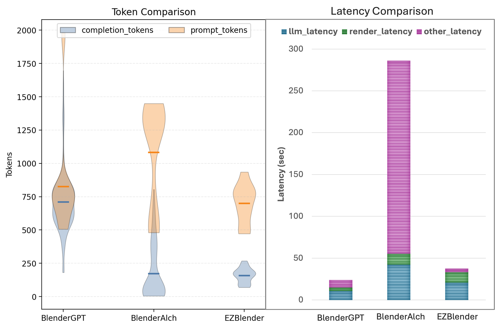
</p>

## Architecture

1.  **Planner**: Receives the prompt and current scene state, then creates a task list.
2.  **Specialized Agents**: 
    - `Modder`: Handles geometry and shape keys.
    - `Material`: Manages shaders and textures.
    - `Lighting`: Adjusts scene illumination.
    - `Camera`: Optimizes camera placement.
3.  **Refinement Loop**: The `Modder Critic` evaluates results and iterates until satisfied.

## Results Gallery

All demos below are saved under [`output/`](./output). Each case shows **before** (`init_render.png`) → **after** (`result_render.png`).

### Body Shape Editing (`body1`–`body3`)

| Case | Task | Before | After |
|:----:|------|:------:|:-----:|
| **body1** | Soft-body character with a chrome / metallic material look |  | 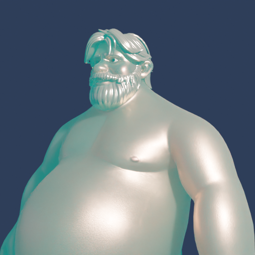 |
| **body2** | Transform into a muscular bodybuilder (wide shoulders, chest, abs) |  | 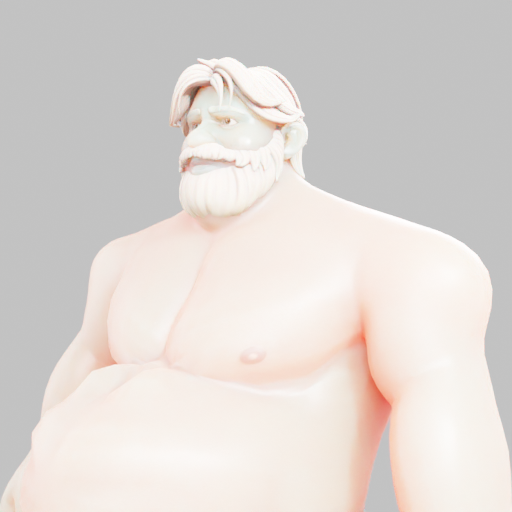 |
| **body3** | Extreme muscular physique with belly shrink + full muscle shape keys | 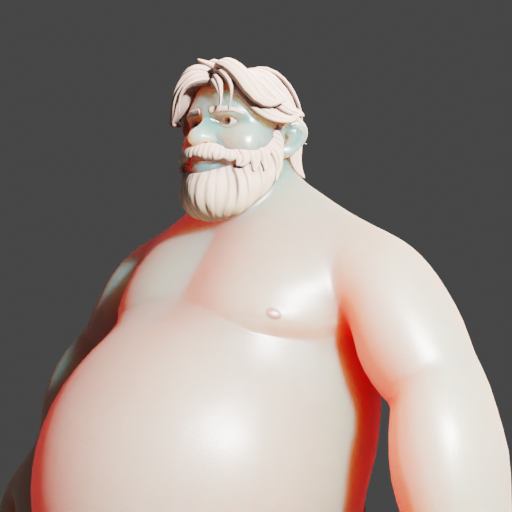 | 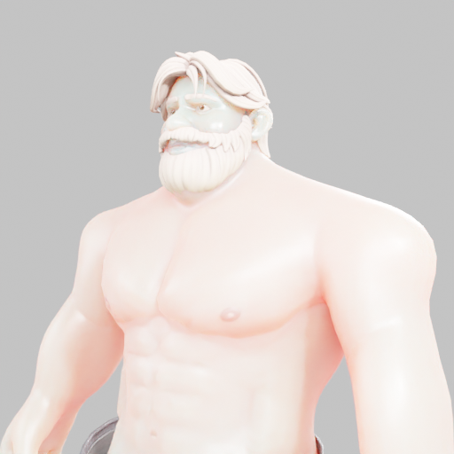 |

### Facial Expression Editing (`face1`)

| Case | Task | Before | After |
|:----:|------|:------:|:-----:|
| **face1** | Concerned / tense expression (furrowed brows, narrowed eyes, pursed lips) plus darker cinematic lighting | 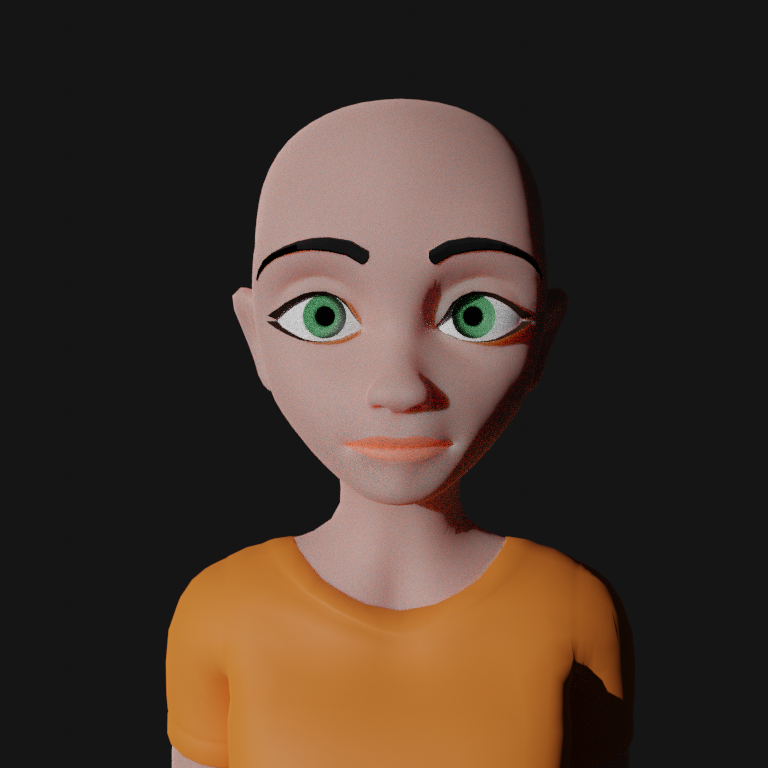 | 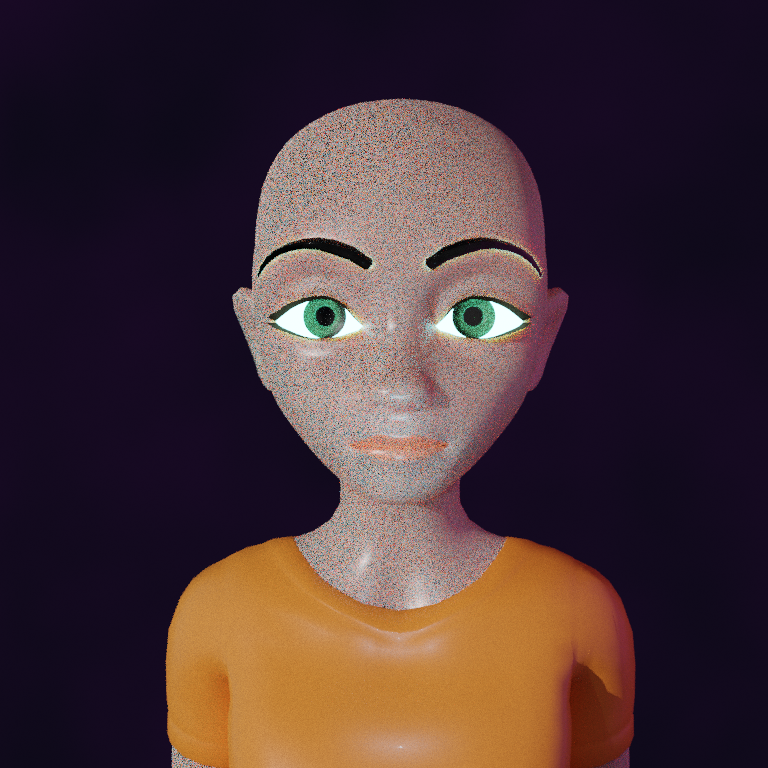 |

### Product Scene Editing (`lotion1`–`lotion4`)

Shared input scene: a soft pink product shot of a cleanser bottle.

| Case | Task | Before | After |
|:----:|------|:------:|:-----:|
| **lotion1** | Mirror-like gold / chrome material (trophy-style reflective finish) |  |  |
| **lotion2** | Warmer mauve / dusty-rose lighting and environment |  | 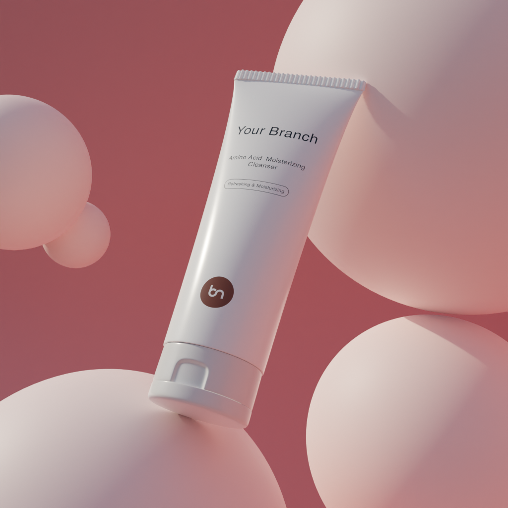 |
| **lotion3** | Cyberpunk cyan + magenta neon materials and lights | 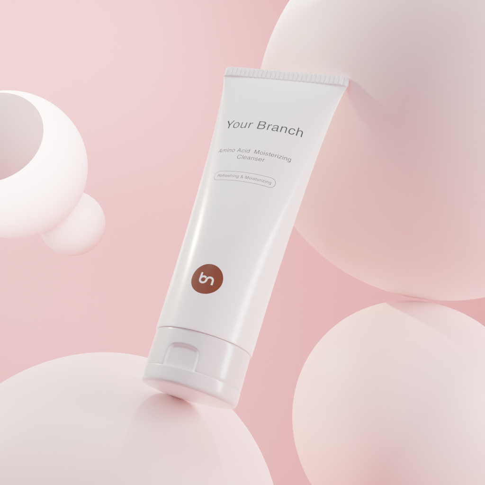 | 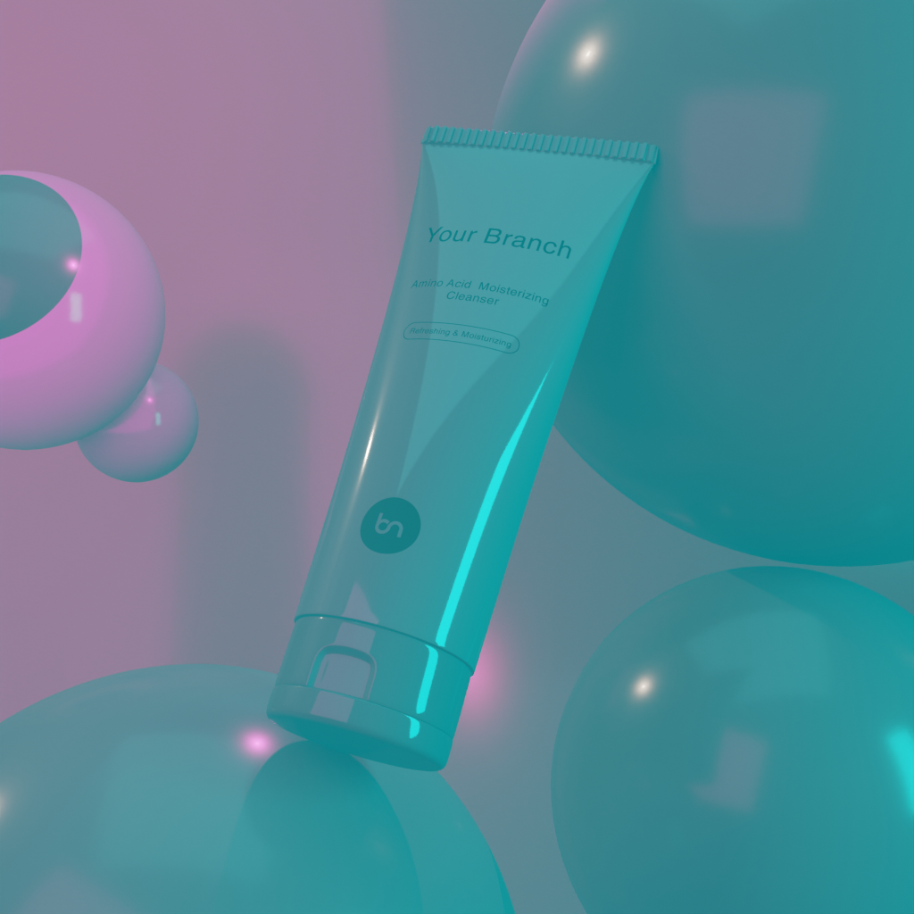 |
| **lotion4** | Neon pink / cyan cyberpunk aesthetic with colored rim lights |  | 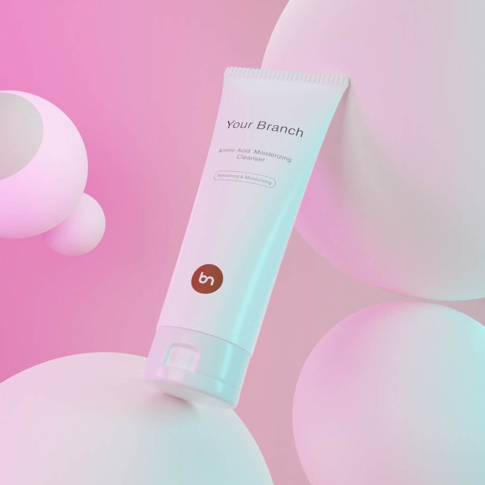 |

<details>
<summary>Compact overview (all results)</summary>

<p align="center">
  
  
  
  
</p>
<p align="center">
  
  
  
  
</p>

</details>

## Installation

1.  **Clone the repository**:
    ```bash
    git clone https://github.com/your-username/EZBlender.git
    cd EZBlender
    ```

2.  **Install dependencies**:
    ```bash
    pip install -r requirements.txt
    ```

3.  **Setup Environment Variables**:
    Set your OpenAI credentials:
    ```bash
    /creds/openai.txt
    ```

## Agent Skill (`/ezblender`)

The multi-agent workflow is packaged as an AI agent skill (Grok / Claude-compatible layout):

```
.agents/skills/ezblender/
  SKILL.md                 # agent instructions
  references/presets.md    # blend / script presets
  scripts/run_ezblender.py # preset launcher
  scripts/run_ezblender.ps1
```

**With an agent that loads skills:** invoke `/ezblender` or ask to “edit this Blender scene with EZBlender”.

**CLI helper (no agent required):**

```bash
python .agents/skills/ezblender/scripts/run_ezblender.py \
  --prompt "Make the character extremely muscular" \
  --preset body \
  --blender_exe "/path/to/blender" \
  --out_dir "./output/body_muscular"
```

Presets: `body` | `face` | `wineglass` | `lotion` | `wood` | `roses`.

## Quick Start

Run the main workflow with a simple prompt:

```bash
python main.py --prompt "Make it glowing neon red" --blender_exe "/path/to/blender" --scene_blend "blenderalch/starter_blends/lotion.blend" --init_script "blenderalch/blender_scripts/lighting_examples/lotion.py" --render_script "blenderalch/blender_base/lighting_adjustments.py"
```

## Tutorial: Example Use Cases

Commands below reproduce the gallery cases under `output/`.

### 1. Shape Transformation (The Modder Agent)
**Goal**: Transform a soft character into a muscular bodybuilder (`body2` / `body3`).
```bash
python main.py \
    --prompt "Make the character an extremely muscular professional bodybuilder with bulging biceps and chest" \
    --blender_exe "/path/to/blender" \
    --scene_blend "blenderalch/starter_blends/body_shapekeys.blend" \
    --init_script "blenderalch/blender_scripts/shapekeys_examples/bodyshape.py" \
    --render_script "blenderalch/blender_base/bodyshape_shapekeys.py" \
    --model "gpt-5.4-mini" \
    --out_dir "./output/body2"
```

### 2. Material Mastery (The Material Agent)
**Goal**: Reflective pure gold / chrome product material (`lotion1`).
```bash
python main.py \
    --prompt "Turn the entire object into a shiny, reflective pure gold material like a trophy" \
    --blender_exe "/path/to/blender" \
    --scene_blend "blenderalch/starter_blends/lotion.blend" \
    --init_script "blenderalch/blender_scripts/lighting_examples/lotion.py" \
    --render_script "blenderalch/blender_base/lighting_adjustments.py" \
    --model "gpt-5.4-mini" \
    --out_dir "./output/lotion1"
```

### 3. Atmospheric Lighting (The Lighting Agent)
**Goal**: Midnight cyberpunk neon lighting (`lotion3` / `lotion4`).
```bash
python main.py \
    --prompt "Midnight cyberpunk theme with dark background and glowing high-intensity purple and cyan neon rim lights" \
    --blender_exe "/path/to/blender" \
    --scene_blend "blenderalch/starter_blends/lotion.blend" \
    --init_script "blenderalch/blender_scripts/lighting_examples/lotion.py" \
    --render_script "blenderalch/blender_base/lighting_adjustments.py" \
    --model "gpt-5.4-mini" \
    --out_dir "./output/lotion3"
```

### 4. Parallel Efficiency (The Parallel Workflow)
**Goal**: Multi-agent collaboration for a full cyberpunk product look (`lotion4`).
*Note: This mode sends all agent requests simultaneously, significantly reducing execution time.*
```bash
python main.py \
    --prompt "Transform this lotion bottle into a glowing cyberpunk aesthetic with intense neon pink and cyan lights and reflective tech-style materials" \
    --blender_exe "/path/to/blender" \
    --scene_blend "blenderalch/starter_blends/lotion.blend" \
    --init_script "blenderalch/blender_scripts/lighting_examples/lotion.py" \
    --render_script "blenderalch/blender_base/lighting_adjustments.py" \
    --model "gpt-5.4-mini" \
    --parallel \
    --out_dir "./output/lotion4"
```

### 5. Facial Expression (Shape Keys)
**Goal**: Edit facial expression via shape keys (`face1`).
```bash
python main.py \
    --prompt "Make a concerned, tense expression with furrowed brows and slightly pursed lips" \
    --blender_exe "/path/to/blender" \
    --scene_blend "blenderalch/starter_blends/face_animation.blend" \
    --init_script "blenderalch/blender_scripts/shapekeys_examples/facialshapekeys.py" \
    --render_script "blenderalch/blender_base/bodyshape_shapekeys.py" \
    --model "gpt-5.4-mini" \
    --out_dir "./output/face1"
```

## Acknowledgement
We sincerely appreciate the authors of [BlenderAlchemy](https://github.com/ianhuang0630/BlenderAlchemyOfficial),
since EZBlender is a streamlined evolution of the BlenderAlchemy project. 
We have distilled the prompting logic from the original work into this lightweight, multi-agent framework, while preserving the original assets and research heritage within the `blenderalch/` directory. 

## Citation
If you find this project helpful, please cite our paper. GitHub also exposes a **Cite this repository** button from [`CITATION.cff`](./CITATION.cff) once this file is on the default branch.

```bibtex
@InProceedings{Wang_2026_WACV,
    author    = {Wang, Hao and Zhu, Wenhui and Tang, Shao and Wang, Zhipeng and Dong, Xuanzhao and Li, Xin and Chen, Xiwen and Bastola, Ashish and Huang, Xinhao and Wang, Yalin and Razi, Abolfazl},
    title     = {EZBlender: Efficient 3D Editing with Plan-and-ReAct Agent},
    booktitle = {Proceedings of the IEEE/CVF Winter Conference on Applications of Computer Vision (WACV) Workshops},
    month     = {March},
    year      = {2026},
    pages     = {1343-1352}
}
```
